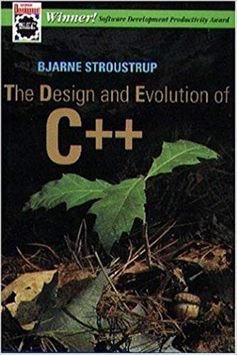

name: title-layout
layout: true
class: center, middle, title

---
name: basic-layout
layout: true
class: left, top

---
name: title
template: title-layout

# C++ Past vs. Future

Titus Winters<br/>
<a href="mailto:titus@google.com">titus@google.com</a><br/>
<a href="https://twitter.com/tituswinters">@TitusWinters</a>

???
For a little while earlier this year, my team was playing a C++ game. 
We never came up with a good name for it, but I might name it something like

---
template: title-layout

# Everything is Terrible
## The Game

---
template: title-layout

# The Code Review Training Game

---
template: title-layout

# *Ugggggh*

???
The gist of this game is simple: 

---
template: basic-layout

# Find the "biggest" safe C++ feature

**Language** - types, classes, move semantics, overloading, templates, etc

**Library** - string, vector, type traits, optional, variant, any, iostreams, etc

???
The gist of this game is simple: come up with the “biggest” feature in C++, either language or library, that doesn’t need any warning signs. Like, if the junior dev on your team started using that feature all the time - what’s the scary story you tell them to temper their enthusiasm?

You toss out such a feature, and the other players produce details to show that your feature maybe isn’t perfectly safe to use in all cases. If nobody can come up with an example (or the examples don’t seem sufficient to warn said junior dev), and people agree that your feature is bigger than any previous such feature, then you’re in the lead.  Play until you stop playing. 

---

template: basic-layout

# I'll try "move semantics"

???

For example, you might not be trying very hard and say “Move semantics.”  Great feature. Wild performance improvements everywhere. 

---

template: basic-layout

# I'll try "move semantics"

*   **use-after-move**
*   **No perfect static-detection of use-after-move**

```c++
void annoying(std::vector<Foo>& v, int i, bool b) {
  if (b) Consume(std::move(v[i]));
}
```

???
---

template: basic-layout

# I'll try "move semantics"

*   **use-after-move**
*   **No perfect static-detection of use-after-move**
*   **Valid-but-unspecified state**

???

which makes perfect sense from the committee’s perspective, but is hardly satisfying for someone coming to C++ cold.

Of course, the point of this game isn’t really to win, it’s mostly a motivator to swap stories and train people to be on the lookout for the goofy edge cases.

---

template: basic-layout

# How about `std::function`?

???
Are there areas here that are worth calling out?  Where are the tripping hazards for something as simple as std::function?  Anyone?

I can think of 3.

---

template: basic-layout

# How about `std::function`?

*   Requires copyable callables

```c++
void f() {
    std::unique_ptr<int> up;
    int i = 1;
    auto l = [up=std::move(up)] () {};
    std::function<void(void)> f = l;  // Build fail
}
```
???
std::function requires copyability, even if the underlying callable is move-only. So you can’t bind a unique_ptr into a lambda by value and type erase that with a std::function. Arguably this is a fine choice, except it seems like surprisingly often you want to give ownership to a callback. 
We maybe missed the point and *should* have provided a move-only function-like type, given how common and important that use case is. I hear questions
about this all the time.

---

template: basic-layout

# How about `std::function`?

*   Some performance cost

???

Because it has value-semantics and type erasure, std::function has slightly higher overhead than you might have with lambda directly, Concepts or other template-based callable machinery, or something like function_ref.

---

template: basic-layout

*   Const-correctness / thread-safety bug

```c++
struct Callable {
    void operator() () { count++; }
    void operator() () const = delete;
    int count = 0;
};

void f() {
    Callable counter;
    std::function<void(void)> f = counter;
    f();

    const auto cf = f;
    cf();  // EH?
}
```

???

std::function is broken wrt. const correctness.  Generally, if you've got a value-type (copyable, owns its data, all of that), when it is const you can't do anything that modifies its underlying.

---

template: basic-layout

# How about `std::function`?

*   Const-correctness / thread-safety bug

```c++
void f() {
  std::optional<int> op = GetThingy();
  (*op)++;

  const auto cop = op;
  (*cop)++;  // BUILD BREAK
}
```

???

Like, for comparison if we did this with optional or vector, it clearly wouldn't work. The rest of std::function's operators are
rigged as if it were a Regular type, but in this one weird way it smells Regular but with a lurking thread-safety bug.

---

template: basic-layout

# How about `std::function`?

*   Requires copyable callables
*   Some performance cost
*   Const-correctness / thread-safety bug

???

Those first two feel like slightly surprisng results of the design.  The last feels, to me, like a bug.

All of which is a long way to motivate the question: 

---

template: title-layout

# Is the Committee infallable?

???

who here thinks that the committee is infallable? 

So, if we aren’t infallable, then we’re going to make mistakes from time to time. Hopefully rarely.  

How does the committee fix mistakes? 

---

template: title-layout

# How *should* the Committee fix mistakes?

???

We’ve all heard the Silicon Valley cliche: move fast and break things.  That clearly works at some level when you’re producing web applications: oh geeze, there’s a bug, I guess we’ll push a new version of the PHP code or whatever. But how do we “move fast” for something like a programming language?  Move fast and break things works great for apps, but no so much for foundations or platforms - people are relying on you to *not* break things.

---

template: title-layout

# Backwards Compatibility
## The early years

???

If we go all the way back to the early years of the language (or, I assume, the early years of any successful language), an awful lot of effort was spent on keeping backwards compatibility. 

---

template: title-layout



???

Bjarne mentions this regularly in the early chapters of D&E (which you should read). 

---

template: title-layout

# Backwards Compatibility
## The early years

???

In order to not lose users to other upstart languages in the early days, as new features were added Bjarne paid great care to ensure that existing programs didn’t have to change except in extraordinary circumstances.

---

template: basic-layout

# Backwards Compatibility - Early Days

**Dozens (hundreds?)** of C++ programs

???

Back during those early days where backwards compatibility was first being discussed, there were probably dozens, maybe hundreds of C++ programs. 

---

template: basic-layout

# Backwards Compatibility - Early Days

**Dozens (hundreds?)** of C++ programs

**A million lines of code**

???

There might have even been a million lines of code.  Asking for a rewrite in order to accept a new feature would be asking for a lot.

---

template: title-layout

# Backwards Compatibility - Present
## 50BLoC - 1TLoC

???

These days, I estimate that there’s probably something upwards of 50 billion lines of C++ code. Probably not as much as a trillion.  Probably.  But lets be conservative here and just say 50 billion.

---

template: title-layout

# Legacy?

???

What percentage of that is “legacy”?  How do we even define that? For my purposes here, maybe lets say “code that was written before the current standard that won’t necessarily be edited or refactored to take advantage of recent changes” - stuff that works fine as it is and isn’t being fiddled with.

My gut says that number is definitely less than half of all C++ code (so, definitely less than 25BLoC).  But definitely more than 5% (so definitely more than 2BLoC). If we said 10% that feels plausible to me and still fairly conservative

---

template: title-layout

# Today's "Legacy" Code: 5BLoC

???
5 billion lines of C++ code exists today, works fine, and will continue to work without being tinkered with. Maybe someone will mount an expedition to go fix a latent bug in there once in a while, but by and large we can pretend that it’s “done”.  That’s cool. 

---

template: basic-layout

# Today's "Legacy" Code: 5BLoC

*   **Linux Kernel** - 20MLoC
*   **Windows** - 50MLoC
*   **Google C++** - 250MLoC
*   **Google (Total)** - 2BLoC

???
The Linux kernel is roughly 20MLoC.  Windows is reputed to be 50MLoC.  The codebase I help maintain at Google is 250MLoC for Google-authored C++, and something like 2BLoC for absolutely everything across languages and third-party deps.

So we’re saying there’s 2 or 3 Googles worth of C++ code out there that works fine and may never be touched again - it may be stable indefinitely if we (the committee) don’t force it.  Put another way: that’s 5 or 6 orders of magnitude more code than Bjarne was worried about when he started paying attention to backwards compatibility.

---

template: title-layout

# Today's "Legacy" Code: 5BLoC

???

So that’s the problem that we face: the committee makes mistakes, and as time marches on the definition of “legacy” changes - there’s probably “legacy” code written in C++11 these days.  And we worry about this, we really do.  Way back in 2014 I lobbied for a change to std::function to make it not so broken with respect to const-correctness.  How many of you were using C++11 professionally in 2014?  Keep your hands up if you were using std::function as a vocabulary type?  Keep your hands up if you want a const std::function to preferentially call the non-const call operator?  Yeah, that’s where I was.  But the committee was worried about “the scope of the breakage.” (I suspect that scope was pretty close to zero at that time, and manifestly worse now.)

---

template: title-layout

# Compatibility Breaks: Bad

???

And to be fair, breaking a build is a sort of rough thing - given the layering and network-expansion of dependencies in modern software, if you break the build for some project, it’s not just the devs of that project that are affected on average 

---

template: title-layout

# Compatibility Breaks: Bad
## High blast-radius, downstream deps, "bystanders"

???

you wind up affecting all the downstream dependencies as well.  That’s a pretty good way to annoy users: they did nothing wrong, but they are affected by choices made by the project they depended upon - either the dep that broke, or the language itself.  Not a great way to win hearts and minds.

---

template: title-layout

# Prioritize Backward Compatibility

???

So it’s very reasonable to prioritize backwards compatibility pretty aggressively.  Sooooo much code works fine as it is.  Breaks have a super-linear blast radius - it’s mostly bystanders, not offenders. We’ve *always* prioritized backwards compatibility - it’s quite possibly a big part of why C++ caught on in the first place.  This is why Herb and Bjarne talk about evolving the language without breaking backwards compatibility.

---

template: title-layout

# Evolve as "Subset of a Superset"

???

The C++ Core Guidelines are part of the general strategy: we’re going to extend the language, and then tell people to stay away from the icky parts (a subset of a superset). The icky parts will still be there, but only the curated and well-tested subset of the newly-expanded language will be used for new code.  Old stuff works, new stuff is safer and easier, everyone wins. 

---

template: title-layout

<h1>Stability</h1>

???

Stability.

---
template: basic-layout
class: white-slide

background-image: url(coin.jpg)

???
TODO - white background?

Now lets look at the other side of the coin.  We know (or at least accept for the sake of argument) that the committee makes mistakes these days. We know that C++11 has at least some mistakes in it (std::bind, std::function).  Does the older chunk of the language also contain things that we wish we could change?  

It's time for 

---

template: title-layout

# Scary Stories with Titus!

???

We'll start with one that I presented in my talk on SD-8 at CppCon last month.
If you were there or if you've seen the video, don't chime in immediately.

---
layout: true
name: ispolite
template: basic-layout

```c++
namespace libs {
bool contains(std::string_view needle, 
              std::string_view haystack); 

void is_polite(std::string_view haystack) {
  assert(contains(haystack, "please"));
}
}
```
---
template: ispolite

???

Who sees how this code might be risky when you’re upgrading from one version of the language to another?

I’ll give you a hint: it’s one of the scary 3-letter acronyms in C++.

That’s right folks, it’s my old nemesis ADL.

---
layout: true
name: ispolite2
template: ispolite

C++20
```c++
namespace std {
bool contains(std::string_view corpus, 
              std::string_view target);
}
```

---
template: ispolite2

???

If we provide a standard version of contains with a similar signature, your code will break.

Well, hopefully break.  It’s also possible with some type conversion trickery for our newly-introduced version to be a better match via ADL, and we could silently be a behavior change. Note that the implied order of parameters is different between my suggested std version and your old version - that'll
go poorly if the new version turns out to be a better match (like if your version of contains was a function template, for example)

---

template: basic-layout

# Argument-Dependent Lookup (ADL)

???

ADL is short for “Argument Dependent Lookup”.  
---
template: basic-layout
class: center, middle

```c++
contains(foo, bar);
```

???

When given an unqualified function call (one with no “::”’s in the name of the function), 

---

template: basic-layout

# Argument-Dependent Lookup (ADL)
## Search in: 

*   Current and enclosing scopes

???

we look in the current scope, all enclosing scopes 

--

*   The "associated namespaces" of all arguments and template parameters.

???

AND (drumroll please) The “associated namespaces” of all arguments and template parameters.

---
template: ispolite

???

That means that when you write “contains”, a function call that passes any standard type is going to do overload resolution from the functions in the current namespace, parent namespaces, as well as std (if the arguments are actually from std - it’s arguments not function parameters, which is bonus fun).

If you really want to be well-protected from ADL issues when upgrading from one version of a library to another, you had better not have any unqualified function calls (to *any* library) that accept arguments from the library being upgraded. 

---
template: title-layout

## No unqualified calls to `snake_case` functions that accept arguments of standard types.

???

Which is, frankly, not the type of rule that people will generally understand or obey. It’s just too wild.

OK, so ADL is weird and maybe risky. Doesn't prove that legacy C++ has issues that we want to fix, but it's definitely a creepy area of the language.

What else we got?

---
template: basic-layout

`foo.h`
```c++
namespace libs {
inline bool contains(std::string_view needle, 
                     std::string_view haystack) {
  assert(needle.size() <= haystack.size());
  return haystack.find(needle) != std::string_view::npos;
}
```

???

How about this? We've decided to be efficient and make libs::contains an inline function so we can get that good good 
function inlining optimization.  And because I threw out that scary bit earlier about providing the arguments in the wrong
order, we're asserting that the sizes here aren't backwards.

Depending on your build practices, this may be a bug.  Let me rephrase that: for many (maybe most) people, this has a bug. Can anyone spot it?

---
template: title-layout

# Do you build `all` consistently?

???

The trick here is that if you build *everything* in your program with the same definitions and the same build flags, you’re fine. If you don’t, then you’re skating on thin ice - it’s really easy to violate ODR. 
---
template: basic-layout

`foo.h`
```c++
namespace libs {
inline bool contains(std::string_view needle, 
                     std::string_view haystack) {
  assert(needle.size() <= haystack.size());
  return haystack.find(needle) != std::string_view::npos;
}
```

???
In this particular instance, the issue is the assert - that whole line is nothing when built in production mode, and actually does the assertion in debug mode.  If you build part of your binary in debug mode (say, to try to investigate a crash) and another part in opt mode, but both parts include this header, you've violated ODR. Your program is ill-formed.  You have UB.  All bets are off. Nasal demons. Arbitrary badness may happen.

---
template: basic-layout

# One Definition Rule (ODR)

*   Everything used has to be defined at least once.
*   Some things (functions, variables) must be defined exactly once.
*   Other things (classes, templates, inline functions) may be defined more than once ...
    *   So long as they are identical in each definition
    *   And mean the same thing each time they are evaluated

???

Note that this is about definitions, not declarations. If you are just listing function signatures in a header, you’re fine. Declarations don’t have to match, but definitions *really* have to match.

Why do we have this rule?  Is this just the committee being a bunch of big jerks and making things hard for you?

No, it really isn’t. In fact, in a lot of respects I think the ODR rule is an early version of the provider vs. consumer tradeoff. 

---
template: basic-layout
class: middle

.center-col[
```c++
int x;
int x;  // BUILD BREAK
```
]

???

If you make it really easy and obvious for the compiler that there are two things of the same name, no problem.  And that’s no problem because we *want* to help you.

---
template: basic-layout
layout: true
name: odr1

.left-col[
`foo.h`
```c++
extern const int a;
inline bool IsGood(int b) { 
  return a == b;
}
```
`foo.cc`
```c++
const int a = 42;
```
]
.right-col[
`bar.cc`
```c++
const int a = 17;
```
]

???

---
template: odr1
layout: false

???

But keep in mind C++’s heritage and the ideas of separate compilation and linkage. If we build foo.cc and bar.cc with separate invocations of the compiler
how is this possibly going to work?

It's really important to note exactly the way that ODR manifests: when you violate ODR by providing multiple incompatible definitions for the same entity,
that is "ill formed, NDR" - your program isn't required to compile, but the compiler isn't required to produce a diagnostic either. It's *absolutely* 
a bug, not just implementer freedom or whatever - there is no semantically-consistent way to put all of these pieces together into the same program.
Your program is nonsense.

---
template: title-layout

# Ask the linker to diagnose it?

???

You could say “well, even if it’s built separately, we could still add a step to the linker to identify any redefinition”.

---
template: odr1

???

But I'll say: as soon as the compiler starts doing constant folding as a basic optimization, it stops being clear that those variables even exist, necessarily. 

---
template: basic-layout

# One Definition Rule (ODR)

*   Everything used has to be defined at least once.
*   Some things (functions, variables) must be defined exactly once.
*   Other things (classes, templates, inline functions) may be defined more than once ...
    *   So long as they are identical in each definition
    *   And mean the same thing each time they are evaluated

???

And those are just the basic things where the rule is an easy “must be only one.”  What about templates or inline functions? Checking that those are “the same” in each TU where they are used starts looking an awful lot like reparsing/recompiling.

All of which is to say, ODR is how we say “hey, don’t do weird things. We’re going to assume that a Foo in one TU is a Foo in another TU. We’re going to optimize along those lines. You’ll get faster compilation time if you don’t make us enforce that, and you’ll get better optimization if we can assume it.”  And we *can’t* even issue a diagnostic reliably because of separate compilation.

ODR is going to be a monster in the general case *at least* until modules is everywhere.  It might still be a big pitfall even in a modules world - I think it’s too soon to be sure on that point. But for at least the forseeable future, even things like an assert in a header represent a surprisingly dangerous potential bug. It’ll *probably* work fine, it certainly won’t issue a diagnostic … but if something goes wrong you’re in for a world of painful debugging where nothing makes any sense.  (I’ll take that as a reminder: build everything from source, with the same flags, at the same time if possible.)

Am I saying that ODR is a bug, or that fundamentals of C++ are broken?  No, I don't think we can do any better in this situation. Mostly I bring it up for one critical reason: you're probably violating this, and your code is probably what I call "happens to be" working - it isn't right, but the wrongness hasn't manifested in such a way to hold you back ... yet.  C++ is that type of language: because we can't pay for runtime diagnostics on these sorts of things, you can (and often do) have code that is completely illegal that maybe happens to work.  

---
template: title-layout

# Correct vs. Happens to Work

???

Understanding that, really understanding how likely it is that a given library is actually "happens to work" as opposed to actually bug-free, really makes me think about legacy code differently.  Other people on the committee say "Well this code has been out there forever and works fine" and I hear "This code has been out there forever - maybe its bugs have been tracked down, maybe they're still just asleep."  In practice, I see a ton of "happens to work" and very little "actually correct" - it's just far too easy to violate things like ODR in a way that you can get away with.

Until you change compilers or linkers or build systems, and then suddenly you can't get away with it anymore.

---
template: title-layout

# ABI (Application Binary Interface)

???

Lets try another one. ADL gets scary when we talk about upgrading between library versions. ODR gets scary when anyone does something clever and we don’t build from source consistently and reliably. How about one that is a matter of both backwards compatibility and performance? Lets talk briefly about ABI.

---
template: basic-layout

# ABI

```c++
using Properties = 
  std::unordered_map<std::string, std::any>;
```

???

For instance, say I’m building a plugin API for my new application framework, and I want to pass a collection of properties.  So maybe I’m going to want to pass something like this. 

What’s the practical implication of doing something like that?  
Well, among other things: 

---
template: basic-layout

# ABI

*   Algorithm for `std::hash<std::string>` must be fixed
*   Lookup strategy for `std::unordered_map` must be fixed
*   Memory layout for `std::unordered_map`, `std::string`, `std::any` must be fixed

???

In the last 3 months I’ve seen research reports from 3 individual experts and two major corporations on how to get better performance out of hash containers - both changing the probing algorithms, packing structure, interaction with hash functions.  I’ve got reason to believe that reasonable workloads can be improved by 10s of percentage points in CPU, with less memory usage.  But now we’ve chosen by accident to rely on one particular compilation of unordered_map and std::hash of std::string. If hashing research continues, and we get better and better at vectorizing hash table operations … you won’t be able to use any of that. 

In fact, you're already in that world: your standard library vendors have all agreed to prioritize binary compatibility going back as far as possible over potential performance improvements. 

Here we went from "I might pass a standard library type between binaries built at different times" to "I can no longer apply recent research or optimization to my hash containers." That's pretty fundamental when we're talking about ABI.

---
template: basic-layout

# ABI
## Comparable to plug/port design, or sender/receiver design

*   **Physical connection** - Name mangling
*   **Logical connection** - Layout and meaning of binary representation of a type

???

---
template: basic-layout
class: center

# ABI - Name Mangling

.center-col[
| *Mangled*     | *Code* |
| :---          | :--- |
| _Z1fv         | `f()` |
| _Z1fi         | `f(int)` |
| _Z1fIiEvi     | `void f<int>(int)` |
| _ZN1N1fE      | `N::f` |
| _Zrm1XS_"     | `operator%(X, X)` |
| _ZN3FooC1Ev   | `Foo::Foo()` |
| _Z1fSs        | `f(std::string)` |
]

???

On the one hand, there's the simple physical connection: name mangling - the names that the linker uses to resolve symbols. Anything that changes the mangled name of a symbol can cause an ABI change. Since mangling isn't standard, there are some variations between vendors - for instance, MSVC doesn't mangle variadic templates specially, so changing from foo<T> to foo<T...> is compatible for them - all existing foo<T>'s will produce the same mangling as future foo<T>'s after that change. But gcc/clang share a mangling scheme and encode variadic templates differently, and thus would be unwilling to accept a widening of a single-argument template into a variadic one - existing compiled code would stop linking.

---
template: title-layout

# ABI - Binary representation
## How are your bits interpreted?

???
On the other hand, there's the semantics of the communication: how the bits are layed out an interpreted. The simplest part of that is "does the size of this object change" (which is clearly a break). But more subtly - if the *interpretation* of the same sequence of bits varies from one build to another (pre/post change) then passing an object built under one schema to a receiver that will process bits under a different schema will inherently be a problem.  
---
template: basic-layout

# ABI - Binary representation / semantics

.left-col[
```c++
class string {
 // ...
 private:
  char* data_;
  size_t allocation_;
  size_t size_;
};
```
]

.right-col[
```c++
class string {
 // ...
 private:
  char* data_;
  char* end_allocation_;
  char* end_;
};
```
]

???

In a really simple form, you can imagine changing the type (but not the size) of your class members. A string object built under one of these
representations / schemas is represented in memory as 3 words worth of bits with a certain meaning: a string object built under the other
representation is 3 words worth of bits with a completely different interpretation.  The type has the same name, mangles the same, has the same
API, but because you've changed its implementation details, precompiled code won't work across such a change.

---
template: basic-layout

# ABI - Hash Containers

*   **hash** changes

???
if the mapping from T to hash code changes, we won't be able to re-hash and identify the object in the container

--

*   **interpretation of hash/probing** changes

???
if the interpretation of the hash code by the container changes (in terms of how it probes / packs), then we won't be able to find the object again

--

*   **bookkeeping data** changes

???
if the bookkeeping data in the hash object changes representation or layout, we're also horribly broken

The last time that C++ as a whole had a major ABI break was in C++11 - the implementation and representation of std::string changed in a way that wasn’t *binary* compatible with older code. This caused endless frustration, and queries about “what is going on, why doesn’t my code work?” continue to this day. The maintainers of the various standard libraries (quite reasonably) want to avoid repeating that.

On this one, MSVC may be ahead of the game on this - they haven’t promised binary compatibility in general, and upgrading from one version of MSVC to another often caused binary incompatibility in the standard library.  The community may not understand *why* there’s an incompatibility, but they do sorta understand that libraries built with one version won’t work with libraries built with another version.  Microsoft is trying to break things less frequently, which is good for users … in the short term. I’m not so sure that letting them pretend they’ve got a long-term stable platform is the right choice … 

---
template: title-layout

# ABI, ODR, ADL

???

Anyway, that’s a 10,000 foot summary of the scary 3-letter issues, ADL, ODR, ABI.  If you knew, really knew, all of this going into this talk, great.  For the rest of you, I’d be willing to put money on the notion that your project is built on a house of cards.  Hardly anybody knows all of these issues, much less understands how much they are paying for them in terms of mystery bugs, performance that their standard library cannot grant them, or surprising costs when upgrading between language versions or even compiler versions. And because of the various ways that people are depending upon this behavior, the committee won’t fix it, because it can’t be done without breaking all of the existing code, including the aforementioned “it’s done don’t touch” legacy code.

For some of these things, we’re stuck.

---
template: title-layout

# ODR vs. Modules

???
ODR is going to be the dominant paradigm until we move to modules. Amusingly, the ability to do so and the need to do so is sort of the crux of the committee arguments on modules for the past few years - there are things that existing code does that we don’t want to allow in the future … but if we don’t allow those things, we also basically can’t help any existing code use modules.  That’s a pretty rough choice to make - it’s maybe not surprising that we have difficulty deciding which direction to jump. (although I hear we’ve hammered out a decent compromise).

---
template: title-layout

# ABI vs. ???

???
For other things, the choices we make are entirely self-inflicted and practical. I don’t think anything in the C++ standard documents actually says that we’ll maintain ABI compatibility - this is basically all from the implementers. We learned as a community that breaking backwards compatibility for pre-compiled code is a thing that people don’t deal with very well.  I suspect this is mostly because most people don’t understand everything that goes into ABI compatibility, and haven’t been really told what they are giving up to achieve that. But let me be very clear: the extent to which the implementers of the compilers/standard libraries adhere to ABI compat is absolutely holding back the language.  If we could get y’all to rebuild regularly, you’d get better performance. I guarantee it.  (Also, you would have less exposure to ODR and that whole “assert” problem. So you could get better performance AND fewer impossible-to-diagnose mystery bugs in exchange for needing to invest in some build farm infrastructure.  That sounds like the type of thing that a CTO should be willing to sign off on, to my mind. Maybe I’m wrong.)

---
template: title-layout

# ADL vs. Tools

???
And then we come to my favorite of these three terrors: ADL. Here’s an email I sent to the language evolution mailing list back in August:

---
template: basic-layout

Literally a majority of my day has been spent discussing ways to turn off ADL en masse. There are at least 3 credible proposals floating around to mangle the design of common libraries (std, abseil, boost) in serious ways to get ADL to stop triggering.

I expect there to be a paper on "lets make everything in std:: into non-functions so that ADL stops over triggering."
---
template: basic-layout

I've had an hour worth of discussion today on "Every library should have a separate internal namespace for all of its functions and all of its types, and then add using directives or the like to unify them."

I've heard several people say that every file should be its own namespace so that we can get ADL to stop triggering.

---
template: basic-layout
All of these options are going to provide a very poor user experience. Compiler diagnostics will worsen, and the ability for non-gurus to write in this style (or understand why we are doing what we are doing) will drop.

Can we *please* come up with a way for ADL to be opt-in? 

---
template: basic-layout
I'm pretty sure I represent the majority of librarians when I say: ADL needs to work for operators (default opt-in), swap, and a very small handful of extension-points that are *designed* for ADL.  This isn't a request to stop supporting namespace-lookup on template parameters, this is full-on a request to stop making calls ambiguous when those calls have no business triggering ADL in the first place.

-- Titus Winters, August 2018

---
template: title-layout

# If the librarians of your language are starting to recommend that we stop writing functions, 
# that should be a warning sign.

???

Or the downthread summary of that: “if the librarians of your language are starting to recommend that we stop writing functions, that should be a warning sign.  I'm conveying that warning.”  Other library people, like John Lakos, chimed in later on with things like “Yeah, we’ve been recommending classes full of static functions instead of free functions at namespace scope, just to avoid ADL issues.”  Eric Niebler from Ranges has been ensuring that the callables in Ranges don’t get specified in such a way as to force them to be functions - because functions are broken in the face of ADL.

What would it take to make ADL less aggressive?  

---
template: basic-layout

# ADL Tamer v0.1

*   **C++20** - Add a no-op attribute / keyword `found_via_adl`
*   **Release a qualifying tool** - Use ADL to figure out what is currently being called, make that explicit.
*   **C++23** - Don't enable ADL in non-generic code except when the function that is called is tagged, then re-resolve via ADL.

???

Here’s a half-baked suggestion: we declare that in C++23 ADL will not be used in non-generic code, except for operators and also for functions that explicitly add a keyword or attribute or the like to say “this should be available to be called via ADL.”  In a C++20 mode, we can pretty easily identify every unqualified function call where ADL is involved and qualify it.  We have to also add to C++20 the keyword or attribute or whatever so we can preemptively mark swap and other non-member extension points as extension points, but that’s not too bad.

Just doing this would go a LONG way toward resolving the problem.  Because remember:

---
template: title-layout

## No unqualified calls to `snake_case` functions that accept arguments of standard types.

???
right now if we want to be actually safe, we need rules like “no unqualified function calls where the arguments are standard types.”  If we can get the workaday programmer writing regular functions to not worry about bizarre nonsense rules like that, that’ll be a big step in the right direction.  People that write generics regularly won’t be helped, but there’s already a different dialect you have to write to produce generics properly.

But what about all of the legacy code?  2 or 3 Google’s worth of C++ code that works fine and won’t ever be changed.  How much of that is depending on ADL in one way or another? Intentionally or otherwise?

---
template: title-layout

# How much legacy code relies upon ADL?
## All of it.

???
Statistically speaking, probably all of it.

So if we make this change, all of that code will break unless it's updated.  If it has to build in mixed modes, that'll be annoying. If there's some legal or contractual reason that the code cannot be updated, that'll be a big hurdle.  Code that may very well have not changed at all in 25 years may stop building or change meaning.

---
template: title-layout

# Brilliant Answer?

???
So what’s the answer?  This is obviously the point in the talk where your brilliant dynamic speaker says “And then I had an AHA moment and there’s a simple-in-retrospect solution!”

--
## No such luck.

???
No such luck.  This is, fundamentally, the most difficult issue facing C++ right now - should the committee make changes to the language such that code that worked fine in C++98, C++11, C++14, C++17 *stops* working in C++20 or C++23? How much annoyance and fragmentation can the language handle? We don’t have an obviously correct answer here - only a lot of opinions.

Personally, I’m pretty sure we can bear more than we’re subjecting people to right now.  Consider, if you will, how much work and frustration you’ve got already when you move between two things that are (on the tin) supposed to be compatible

---
template: title-layout

# Is it cheap to change compilers?

???
switch from gcc to clang or upgrade between gcc versions.  Is that free or cheap or easy? Not usually.  I believe, but cannot prove, that if we make changes carefully and intentionally, we do so in a way that is highly toolable (like qualifying non-generic code that is being invoked via ADL), we can drag all of that legacy along with us. 
---
template: title-layout

# Aim for breakage to be no more annoying than a compiler upgrade

???
I mean, it seems clear to me: if we designed changes carefully and had magically-good tooling, you could run a tooling step over legacy code as if it were a preprocessor and continue to use that legacy code “unchanged” even in C++23 and beyond.

--
## Provide *good* tools to bridge the break.

???
But that’s just my opinion. It’s a risk to head down this path: maybe we can’t predict how hard a change will be to adopt. Maybe the tooling can’t be built. Maybe people just do too much weird stuff in templates and macros and we can’t meaningfully upgrade any of the important legacy. 

My position certainly isn’t universal on the committee - in these types of discussions I can often get the committee to agree in theory to breaking backwards compat intentionally and carefully, but in practice it seems pretty stuck on keeping things stable.  

---
template: title-layout

# C++17: No more `std::random_shuffle`
## Wow that's hard to work around.

???
Well, allegedly keeping things stable: if anyone else has upgraded to C++17 and didn’t have any trouble with the removal of std::random_shuffle, I’d love to hear about it - that’s been a real thorn for us. When the committee does follow through on removing APIs that are slated for deprecation, they
aren't doing that with much (any?) discussion of how hard it is to move off of a thing.  Certainly no experience reports.

In the case of random shuffle, in *theory* you can replace any call to random_shuffle to a call shuffle that provides a random bit generator.  Unless of course you've got code that is depending on the exact sequence of random numbers that is output ... if that happens, you're just gonna have a world of hurt.

---
template: title-layout

# Alternate Theory: Titus is *Totally* Wrong

???
And it’s entirely possible that I’m flat out wrong. It could well be that if we decide to prefer future code over past code, we put out a version of C++ that is so hard to move to that we fracture the community and kill the language.  That’d be a bad outcome - we should definitely be trying to avoid that. 

Another maybe simpler way to look at the tension is to think in terms of slogans and sayings.  First we ask what C++ is about, and the majority answers are (or should be):

---
template: title-layout

C++ is the language that leaves no room for a more efficient language between it and the hardware.

--
<br>
In C++, you do not pay for what you do not use.

???
(In some respects these are saying the same thing, but both phrasings are important.)

On the other hand, there are things that advise us what happens when we don’t make changes. 
---
template: title-layout

With a sufficient number of users, every observable of your system will be depended upon by someone.
--
<br>
A rolling stone gathers no moss. 
--
<br>
(Assumed: non-rolling stones gather moss)

???
When we leave things stable, when the rolling stone of ABI and the like don’t change, Hyrum’s Law creeps in.  This is the thermodynamic truth of software: no matter how well intentioned and well-informed your programmers are, given enough time, every little crack that you can build a hack into will be relied upon.  And given enough time, more and more will build around it until it’s not really moss - it’s just earth.  Changing the ABI once per decade is more frustrating and more expensive than changing the ABI once … and then making it so you cannot depend on it in ways we don’t want to commit to supporting.

---
template: title-layout

# 150 Committee Members

???
So that’s where we are: a fallible group of about 150 people are discussing and debating whether in theory we should prioritize stability over velocity.  There’s a minor preference for velocity, in the abstract. In the concrete, even in the face of “librarians are going to stop writing functions”, it’s unclear that we have the stomach for any significant changes.  

--
# 2,000,000 C++ Programmers
???
I believe the estimate is that there’s maybe 2M C++ programmers in the world, or roughly 13K per committee member. Do you know who represents you?  Does anyone represent you? 

---
template: title-layout

# Past vs. Future
# Stability vs. Velocity

???
In the end, I prefer the velocity side of this equation: I believe above all else that change must be possible, and if it must be possible it’d be better to make it easy.  But I understand the position that stability is important: it’s what got us here in the first place. I don’t think I have all the answers - I know that the committee doesn’t. So we should be reaching out to all of you: where do you stand? Do we need to fix our mistakes?  Or do we need to prioritize stability? 

---
template: title-layout

# Get Involved

???
More than just answering the question of stability vs velocity, I want to encourage all of you to get involved.  Make your voices heard. Go to conferences.  Figure out how to participate in standards discussions. And if you can’t, find committee members that are willing to listen and represent you. There are questions facing the language that are just too big for the committee to answer without hearing from all of you.

---
template: title-layout

# Questions?

<a href="mailto:titus@google.com">titus@google.com</a><br/>
<a href="https://twitter.com/tituswinters">@TitusWinters</a>
